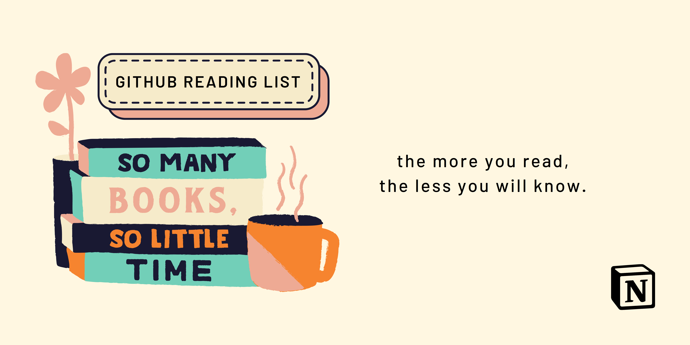

<h3 align="center">Updates a reading list gist to show currently reading books on Notion</h3>

<p align="center">
    <a href="https://www.javascript.com/">
        
    </a>
    <a href="https://github.com/makenotion/notion-sdk-js">
        
    </a>
    <a href="https://prettier.io/">
        
    </a>  
</p>

<h4 align="center">
    This project was inspired by <a href="https://github.com/matchai/awesome-pinned-gists">awesome pinned gists</a>
</h4>

## Getting Started

1. Create a new public [Gist](https://gist.github.com/)
2. Create a [personal access token](https://github.com/settings/tokens/new) with the `gist` scope
3. Clone this repo
```bash
git clone https://github.com/ericfzhu/notion-book-box.git
```
4. Go to Settings > Settings and add the following values:
   1. `GH_TOKEN`: The personal access token you just created
   2. `GIST_ID`: The id of your gist url (`https://gist.github.com/ericfzhu/**f250c8f66128ae70883a031b8dbca982**`)
   3. `NOTION_API_KEY` and `NOTION_DATABASEID`: Follow Notion's [Getting Started](https://developers.notion.com/docs/getting-started) guide to acquire these (Don't forget to invite your integration into your workspace!)
5. Go to Actions and press `Enable`
6. Pin your new Gist to your profile!

## Usage

This project requires your Notion workspace to be a database, and contain a column called `Name` for the title of the book and a column called `Progress` for the current percentage progress in the book.

### Background

If you're wondering why this project seems oddly manual, that's due to the fact that Goodreads is no longer issuing new API tokens and I wanted a way to showcase what I'm currently reading. 😔

### Reading list

You can check out my full reading list on Notion [here](https://ericfzhu.notion.site/12896e3b2c4141ca83ed2993432f9750?v=b37d0e3251974a59ae40bb7b84d2cc71)!
