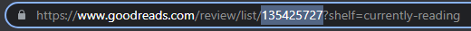

<p align="center">
    
</p>
<h1 align="center">
    Reading Gist
</h1>

<h3 align="center">Updates a reading gist to show currently reading books from GoodReads</h3>

<h4 align="center">
    This project was inspired by <a href="https://github.com/matchai/awesome-pinned-gists">awesome pinned gists</a>
</h4>

## Getting Started

1. Create a new public [Gist](https://gist.github.com/) with filler title and text


2. Create a [personal access token](https://github.com/settings/tokens/new) with the `gist` scope


3. Fork this repo by pressing the Fork button in the top right of this page or via GitHub CLI

```bash
gh repo fork https://github.com/ericfzhu/reading-gist.git
```

4. Go to Settings > Secrets > Actions and add the following values:
   1. `GH_TOKEN`: The personal access token you just created
   2. `GIST_ID`: The ID is the string of characters in the URL of the Gist you've just created
   
   
   3. `GOODREADS_ID`: Go to your GoodReads account and click on the currently reading section in your bookshelves.
   
   
5. Go to Actions and press `Enable`
6. Pin your new Gist to your profile!
